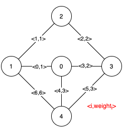
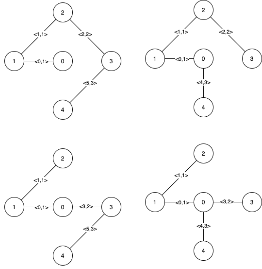
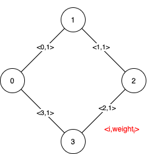

# Kruskal's Algorithm

## 1489. Find Critical and Pseudo-Critical Edges in Minimum Spanning Tree

Given a weighted undirected connected graph with `n` vertices numbered from `0` to `n - 1`, and an array edges where `edges[i] = [a_i, b_i, weight_i]` represents a bidirectional and weighted edge between nodes $a_i$ and $b_i$. A minimum spanning tree (MST) is a subset of the graph's edges that connects all vertices without cycles and with the minimum possible total edge weight.

Find all the critical and pseudo-critical edges in the given graph's minimum spanning tree (MST). An MST edge whose deletion from the graph would cause the MST weight to increase is called a critical edge. On the other hand, a pseudo-critical edge is that which can appear in some MSTs but not all.

Note that you can return the indices of the edges in any order.

Example 1:



```text
Input: n = 5, edges = [[0,1,1],[1,2,1],[2,3,2],[0,3,2],[0,4,3],[3,4,3],[1,4,6]]

Output: [[0,1],[2,3,4,5]]

Explanation: The figure above describes the graph. The following figure shows all the possible MSTs:

Notice that the two edges 0 and 1 appear in all MSTs, therefore they are critical edges, so we return them in the first list of the output.

The edges 2, 3, 4, and 5 are only part of some MSTs, therefore they are considered pseudo-critical edges. We add them to the second list of the output.
```



Example 2:



```text
Input: n = 4, edges = [[0,1,1],[1,2,1],[2,3,1],[0,3,1]]

Output: [[],[0,1,2,3]]

Explanation: We can observe that since all 4 edges have equal weight, choosing any 3 edges from the given 4 will yield an MST. Therefore all 4 edges are pseudo-critical.
```

## Solution

Use the Kruskal's algorithm to find the minimum spanning tree by sorting the edges and picking edges from ones with smaller weights. It's also common to use Union Find structure when implementing Kruskal's algorithm. (see [code examples](/dsa/graph/spanning_tree.py))

Note that:

- To find if one edge is critical, delete that edge and re-run the MST algorithm and see if the weight of the new MST increases
- To find if one edge is non-critical (in any MST), include that edge to the accepted edge list and continue the MST algorithm, then see if the resulting MST has the same weight of the initial MST of the entire graph.

```python
class UnionFind:
    def __init__(self, n):
        self.links = [i for i in range(n)]
        self.sizes = [1] * n
    
    def find(self, idx):
        while idx != self.links[idx]:
            idx = self.links[idx]
        
        return idx
    
    def union(self, x, y):
        x = self.find(x)
        y = self.find(y)

        # x, y are already in the same union, no action
        if x == y:
            return False
        else:
            # for size rebalance
            if self.sizes[x] < self.sizes[y]:
                x, y = y, x
            
            self.links[y] = x
            self.sizes[x] += self.sizes[y]
            return True

def findCriticalAndPseudoCriticalEdges(n: int, edges: List[List[int]]) -> List[List[int]]:
    edges = [(i, x[0], x[1], x[2]) for i, x in enumerate(edges)]
    edges.sort(key = lambda x: x[3])

    # get initial MST
    unionfind = UnionFind(n)
    MST = 0
    for _, u, v, w in edges:
        if unionfind.union(u, v):
            MST += w
    # This MST is guaranteed to be exist
    assert max(unionfind.sizes) == n

    critical = []
    pseudo_critical = []
    for i, u, v, w in edges:
        
        #1 check critical, ignore this edge
        unionfind = UnionFind(n)
        new_MST = 0
        for ni, nu, nv, nw in edges:
            if ni == i: 
                continue
            if unionfind.union(nu, nv):
                new_MST += nw
        
        #1 if the ignored is critical, new MST must be larger
        # or the graph is not connected
        if max(unionfind.sizes) < n or new_MST > MST:
            critical.append(i)
            # if critical, not pesudo-critical
            continue
        
        #2 check pesudo-critical, enforece this edge
        unionfind = UnionFind(n)
        unionfind.union(u, v)
        new_MST = w
        for ni, nu, nv, nw in edges:
            if unionfind.union(nu, nv):
                new_MST += nw

        #2 if the enforced is pesudo-critical, new MST must be
        # the same and the graph is still connected
        if max(unionfind.sizes) == n and new_MST == MST:
            pseudo_critical.append(i)

    return [critical, pseudo_critical]
```
