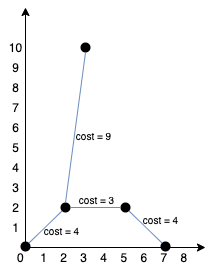

# Prim's algorithm

## 1584. Min Cost to Connect All Points

You are given an array `points` representing integer coordinates of some points on a 2D-plane, where `points[i] = [x_i, y_i]`.

The cost of connecting two points `[x_i, y_i]` and `[x_j, y_j]` is the manhattan distance between them: `|x_i - x_j| + |y_i - y_j|`, where `|val|` denotes the absolute value of `val`.

Return the _minimum cost_ to make all points connected. All points are connected if there is __exactly one__ simple path between any two points.

Example 1:

 

```text
Input: points = [[0,0],[2,2],[3,10],[5,2],[7,0]]

Output: 20

Explanation: We can connect the points as shown above to get the minimum cost of 20.
Notice that there is a unique path between every pair of points.

```

Example 2:

```text
Input: points = [[3,12],[-2,5],[-4,1]]

Output: 18
```

## Solution

Prim's algorithm is a greedy algorithm for building a minimum spanning tree in a weighted and undirected graph.
In this algorithm, we include an arbitrary node in the MST and keep on adding the lowest-weighted edges of the nodes present in the MST until all nodes are included in the MST and no cycles are formed. (see [code examples](/dsa/graph/spanning_tree.py))

Although the min-heap method is often used to implement Prim's algorithm (as it's fairly easy to understand), due to its use of a heap to store the edges, its time and space complexity is suboptimal.
Thus, we will present a more efficient way of implementing Prim's algorithm, which eliminates the use of min-heap to find the next lowest-weighted edge.

In this approach, we use one `minDist` array, where `minDist[i]` stores the weight of the smallest weighted edge to reach the $i^{th}$ node from any node in the current tree.
We will iterate over the `minDist` array and greedily pick the node that is not in the `MST` and has the smallest edge weight. We will add this node to the `MST`, and for all of its neighbors, we will try to update the value in `minDist`. We will repeat this process until all nodes are part of the `MST`.

```python
import math

def calcDist(self, x, y):
    return abs(x[0] - y[0]) + abs(x[1] - y[1])

def minCostConnectPoints(points: List[List[int]]) -> int:
    n = len(points)
    visited = set()
    res = 0

    # this idea is from Dijkstra's algorithm
    min_dist = [math.inf] * n
    # start node is node 0
    min_dist[0] = 0
    while len(visited) < n:
        cur_node = -1
        cur_min_weight_edge = math.inf

        # pick least weight node which is not visited
        for i in range(n):
            if i in visited or min_dist[i] >= cur_min_weight_edge:
                continue
            
            cur_node = i
            cur_min_weight_edge = min_dist[i]
        
        res += cur_min_weight_edge
        visited.add(cur_node)

        # update adjacent nodes
        for nxt in range(n):
            dist = calcDist(points[cur_node], points[nxt])

            if nxt in visited or dist >= min_dist[nxt]:
                continue
            
            min_dist[nxt] = dist
    
    return res
```
