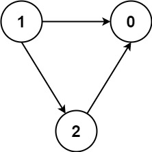

# Topological Sort Using Kahn's Algorithm

## Problem

### 207. Course Schedule

There are a total of `numCourses` courses you have to take, labeled from `0` to `numCourses - 1`. You are given an array prerequisites where `prerequisites[i] = [ai, bi]` indicates that you must take course $b_i$ first if you want to take course $a_i$.

For example, the pair [0, 1], indicates that to take course 0 you have to first take course 1.
Return `true` if you can finish all courses. Otherwise, return `false`.

Example 1:

```text
Input: numCourses = 2, prerequisites = [[1,0]]

Output: true

Explanation: There are a total of 2 courses to take.
To take course 1 you should have finished course 0. So it is possible.
```

Example 2:

```text
Input: numCourses = 2, prerequisites = [[1,0],[0,1]]

Output: false

Explanation: There are a total of 2 courses to take.
To take course 1 you should have finished course 0, and to take course 0 you should also have finished course 1. So it is impossible.
```

### 210. Course Schedule II

(Same contexts...)

Return the ordering of courses you should take to finish all courses. If there are many valid answers, return __any__ of them. If it is impossible to finish all courses, return __an empty array__.

Example 1:

```text
Input: numCourses = 2, prerequisites = [[1,0]]

Output: [0,1]

Explanation: There are a total of 2 courses to take. To take course 1 you should have finished course 0. So the correct course order is [0,1].
```

Example 2:

```text
Input: numCourses = 4, prerequisites = [[1,0],[2,0],[3,1],[3,2]]

Output: [0,2,1,3]

Explanation: There are a total of 4 courses to take. To take course 3 you should have finished both courses 1 and 2. Both courses 1 and 2 should be taken after you finished course 0.
So one correct course order is [0,1,2,3]. Another correct ordering is [0,2,1,3].
```

### 1462. Course Schedule IV

(Same contexts...)

Prerequisites can also be __indirect__. If course `a` is a prerequisite of course `b`, and course `b` is a prerequisite of course `c`, then course `a` is a prerequisite of course `c`.

You are also given an array `queries` where `queries[j] = [uj, vj]`. For the `j`th query, you should answer whether course $u_j$ is a prerequisite of course $v_j$ or not.

Return a *boolean array* `answer`, where `answer[j]` is the answer to the `j`th query.

Example 1:

```text
Input: numCourses = 2, prerequisites = [[1,0]], queries = [[0,1],[1,0]]

Output: [false,true]

Explanation: The pair [1, 0] indicates that you have to take course 1 before you can take course 0.
Course 0 is not a prerequisite of course 1, but the opposite is true.
```

Example 2:



```text
Input: numCourses = 3, prerequisites = [[1,2],[1,0],[2,0]], queries = [[1,0],[1,2]]

Output: [true,true]
```

## Solution

In a __directed acyclic graph__ (__DAG__), we can use __Kahn's algorithm__ to get the topological ordering.

Kahn’s algorithm works by keeping track of the number of incoming edges into each node (indegree). It works by repeatedly visiting the nodes with an indegree of zero and deleting all the edges associated with it leading to a decrement of indegree for the nodes whose incoming edges are deleted. This process continues until no elements with zero indegree can be found.

The advantage of using Kahn's algorithm is that it also aids in the detection of graph cycles.

### Solution for #207

```python
from collections import deque, defaultdict

def canFinish(numCourses: int, prerequisites: List[List[int]]) -> bool:
    indegree = [0] * numCourses
    graph = defaultdict(list)
    for a, b in prerequisites:
        indegree[a] += 1
        graph[b].append(a)
    
    candidates = deque([])
    for i in range(numCourses):
        if indegree[i] == 0:
            candidates.append(i)
    
    visited = set(candidates)
    while candidates:
        cur = candidates.popleft()

        for nxt in graph[cur]:
            indegree[nxt] -= 1
            if indegree[nxt] == 0:
                candidates.append(nxt)
                visited.add(nxt)
    
    return len(visited) == numCourses
```

### Solution for #210

```python
from collections import deque, defaultdict

def findOrder(numCourses: int, prerequisites: List[List[int]]) -> List[int]:
    indegree = [0] * numCourses
    graph = defaultdict(list)
    for a, b in prerequisites:
        indegree[a] += 1
        graph[b].append(a)
    
    candidates = deque([])
    for i in range(numCourses):
        if indegree[i] == 0:
            candidates.append(i)
    
    res = []
    res.extend(candidates)
    while candidates:
        cur = candidates.popleft()

        for nxt in graph[cur]:
            indegree[nxt] -= 1
            if indegree[nxt] == 0:
                candidates.append(nxt)
                res.append(nxt)
    
    return res if len(res) == numCourses else []
```

### Solution for #1462

Of course, another intuitive way to complete topological sorting is by __depth first search__ (__DFS__).

```python
def checkIfPrerequisite(numCourses: int, prerequisites: List[List[int]], queries: List[List[int]]) -> List[bool]:

    # build graph
    graph = {i: [] for i in range(numCourses)}
    for pre, cur in prerequisites:
        graph[cur].append(pre)
    
    # storing all prerequisites (in structure as set, default None)
    memory = [None for _ in range(numCourses)]
    # use DFS to get prerequisites
    def dfs(cur) -> set:
        if memory[cur] != None:
            return memory[cur]
        
        pre_set = set()
        # reach next nodes
        for nxt in graph[cur]:
            tmp_set = dfs(nxt)

            pre_set.add(nxt)
            pre_set = pre_set.union(tmp_set)

        # update memory
        memory[cur] = pre_set
        return pre_set
    
    for i in range(numCourses):
        dfs(i)
    
    res = []
    for a, b in queries:
        res.append(a in memory[b])
    
    return res
```
