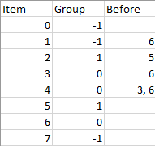

# Topological Sort Using Kahn's Algorithm

## 1203. Sort Items by Groups Respecting Dependencies

There are `n` items each belonging to zero or one of `m` groups where `group[i]` is the group that the `i`-th item belongs to and it's equal to `-1` if the `i`-th item belongs to no group. The items and the groups are zero indexed. A group can have no item belonging to it.

Return a sorted list of the items such that:

- The items that belong to the same group are next to each other in the sorted list.
- There are some relations between these items where `beforeItems[i]` is a list containing all the items that should come before the `i`-th item in the sorted array (to the left of the `i`-th item).

Return __any solution__ if there is more than one solution and return an __empty__ list if there is no solution.

Example 1:



```text
Input: n = 8, m = 2, group = [-1,-1,1,0,0,1,0,-1], beforeItems = [[],[6],[5],[6],[3,6],[],[],[]]

Output: [6,3,4,1,5,2,0,7]
```

Example 2:

```text
Input: n = 8, m = 2, group = [-1,-1,1,0,0,1,0,-1], beforeItems = [[],[6],[5],[6],[3],[],[4],[]]

Output: []

Explanation: This is the same as example 1 except that 4 needs to be before 6 in the sorted list.
```

## Solution

We can apply Kahn's algorithm to do topological sorting on group-level and item-level separately.

```python
def topological_sort(adjacent_graph: dict, indegree: dict):
    # Kahn's algorithm
    n = len(indegree)

    # get initial 0-degree nodes
    queue = deque([])
    sort_res = []
    for i, v in indegree.items():
        if v == 0:
            queue.append(i)
            sort_res.append(i)
    
    while queue:
        cur = queue.popleft()

        for nxt in adjacent_graph[cur]:
            indegree[nxt] -= 1
            if indegree[nxt] == 0:
                queue.append(nxt)
                sort_res.append(nxt)

    return sort_res if len(sort_res) == n else None

def sortItems(n: int, m: int, group: List[int], beforeItems: List[List[int]]) -> List[int]:
    
    group_graph = {}
    group_indegree = {}
    group_id = m
    for i in range(n):
        # assign unique group numbers for group "-1"
        if group[i] == -1:
            group[i] = m
            m += 1
        
        group_graph[group[i]] = []
        group_indegree[group[i]] = 0
    
    NUM_GROUP = m # over-estimation is OK
    item_graphs = [{} for _ in range(NUM_GROUP)]
    item_indegrees = [{} for _ in range(NUM_GROUP)]
    for i in range(n):
        g_id = group[i]
        item_graphs[g_id][i] = []
        item_indegrees[g_id][i] = 0

    # a -> b
    for b, a_list in enumerate(beforeItems):
        for a in a_list:
            # within group edge
            if group[a] == group[b]:
                g_id = group[a]
                item_graphs[g_id][a].append(b)
                item_indegrees[g_id][b] += 1
            # between group edge
            else:
                g_a, g_b = group[a], group[b]
                group_graph[g_a].append(g_b)
                group_indegree[g_b] += 1
    
    group_order = self.topological_sort(group_graph, group_indegree)
    if group_order == None:
        return []
    
    res = []
    for g in group_order:
        item_order = self.topological_sort(item_graphs[g], item_indegrees[g])
        if item_order == None:
            return []
        
        res.extend(item_order)
    
    return res
```
