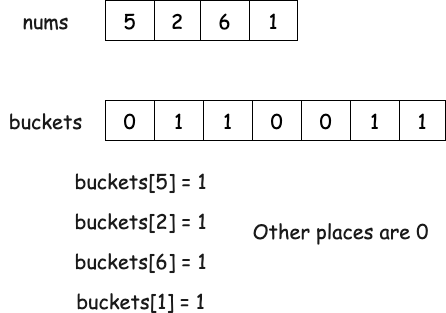
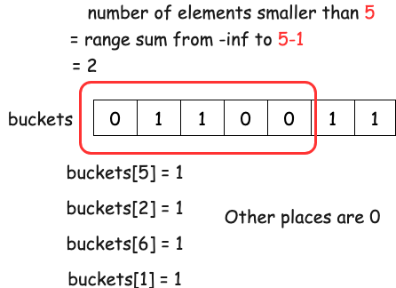

# Segment Tree

## 315. Count of Smaller Numbers After Self

Given an integer array `nums`, return an integer array `counts` where `counts[i]` is the number of smaller elements to the right of `nums[i]`.

Example 1:

```text
Input: nums = [5,2,6,1]

Output: [2,1,1,0]

Explanation:
To the right of 5 there are 2 smaller elements (2 and 1).
To the right of 2 there is only 1 smaller element (1).
To the right of 6 there is 1 smaller element (1).
To the right of 1 there is 0 smaller element.
```

Example 2:

```text
Input: nums = [-1]

Output: [0]
```

Example 3:

```text
Input: nums = [-1,-1]

Output: [0,0]
```

## Solution

Since we need counts of values, we can use an approach similar to bucket sort, where we have buckets of values and `buckets[value]` stores the count of value. For each value, we increment `buckets[value]` by 1. With this approach, the number of elements smaller than `nums[i]` is the range sum of $(-\infty, \text{num}-1]$ in buckets.

With the help of a segment tree or binary indexed tree, we can perform the range sum query in logarithmic time.





```python
class SegTree:
    """
    1-index segment tree for sum
    """
    def __init__(self, n):
        self.n = n
        self.tree = [0] * 2 * n

    def update(self, idx):
        # update count at idx by 1
        idx += self.n

        while idx > 0:
            self.tree[idx] += 1
            idx >>= 1
    
    def query(self, l, r):
        l += self.n
        r += self.n
        s = 0

        while l <= r:
            if l % 2 == 1:
                s += self.tree[l]
                l += 1
            if r % 2 == 0:
                s += self.tree[r]
                r -= 1
            
            l >>= 1
            r >>= 1
        
        return s


def countSmaller(nums: List[int]) -> List[int]:
    M = 10_001
    mySeg = SegTree(2 * M)

    res = []
    for num in nums[::-1]:
        res.append(mySeg.query(0, num + M - 1))
        mySeg.update(num + M)
    
    res.reverse()
    return res
```
