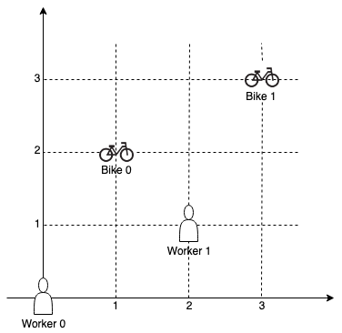
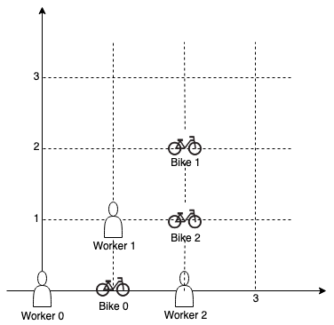

# Bucket Sort

## 1057. Campus Bikes

On a campus represented on the X-Y plane, there are `n` workers and `m` bikes, with `n <= m`.

You are given an array workers of length `n` where `workers[i] = [xi, yi]` is the position of the `i-th` worker. You are also given an array bikes of length `m` where `bikes[j] = [xj, yj]` is the position of the `j-th` bike. All the given positions are unique.

Assign a bike to each worker. Among the available bikes and workers, we choose the ($worker_i$, $bike_j$) pair with the shortest Manhattan distance between each other and assign the bike to that worker.

If there are multiple ($worker_i$, $bike_j$) pairs with the same shortest Manhattan distance, we choose the pair with the __smallest worker index__. If there are multiple ways to do that, we choose the pair with the __smallest bike index__. Repeat this process until there are no available workers.

Return an array `answer` of length `n`, where `answer[i]` is the index (0-indexed) of the bike that the ith worker is assigned to.

Example 1:



```text
Input: workers = [[0,0],[2,1]], bikes = [[1,2],[3,3]]

Output: [1,0]

Explanation: Worker 1 grabs Bike 0 as they are closest (without ties), and Worker 0 is assigned Bike 1. So the output is [1, 0].
```

Example 2:



```text
Input: workers = [[0,0],[1,1],[2,0]], bikes = [[1,0],[2,2],[2,1]]

Output: [0,2,1]

Explanation: Worker 0 grabs Bike 0 at first. Worker 1 and Worker 2 share the same distance to Bike 2, thus Worker 1 is assigned to Bike 2, and Worker 2 will take Bike 1. So the output is [0,2,1].
```

Constraints:

- `n == workers.length`
- `m == bikes.length`
- `1 <= n <= m <= 1000`
- `workers[i].length == bikes[j].length == 2`
- `0 <= xi, yi < 1000`
- `0 <= xj, yj < 1000`

## Solution

One intuitive way to solve this problem is to sort all worker-bike pairs based on their distances, which will require time complexity $O(nm log(nm))$.

However, note the constraints on positions, we could conclude that all distances are in range [0, 1998]. Therefore we could utilize bucket sort to improve the time complexity to $O(nm + k)$ where $k = 1999$ (for we have to create a bucket of length 1998 at first place).

```python
def assignBikes(workers: List[List[int]], bikes: List[List[int]]) -> List[int]:
    # Bucket Sorting
    # distances only have 1999 distinct values (0~1998)
    buckets = [[] for _ in range(1999)]

    n, m = len(workers), len(bikes)
    for i in range(n):
        for j in range(m):

            pos1, pos2 = workers[i], bikes[j]
            dist = abs(pos1[0] - pos2[0]) + abs(pos1[1] - pos2[1])
            buckets[dist].append((i, j))
    
    visited_worker, visited_bike = set(), set()
    res = [-1] * n
    for bucket in buckets:
        for worker, bike in bucket:
            if worker in visited_worker or bike in visited_bike:
                continue
            
            visited_worker.add(worker)
            visited_bike.add(bike)
            res[worker] = bike

            # early stopping
            if len(visited_worker) == n:
                break
    
    return res
```
